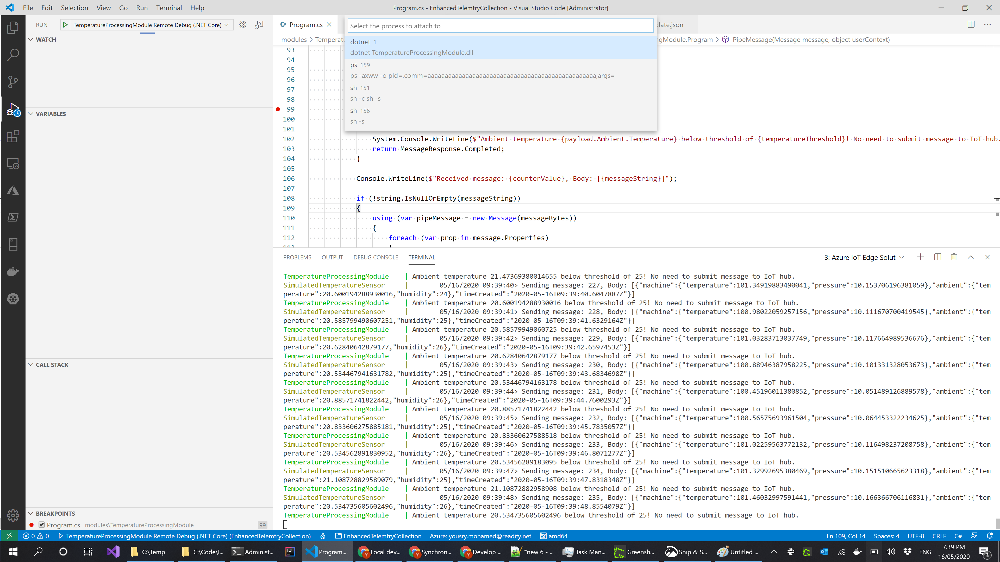

# Development and debugging story


For quick development cycles, it would be very counter-productive to require deploying the changes to the device and testing there. Yes certain pieces of code can be developed in class libraries and unit tested independently, but that's not enough. There should be a simple way to test locally even when the device is off or not available.

### Setup

**Azure IoT Tools** extension pack comes comes with a simulator to facilitate local development. 

Continuing form the solution developed in last [page](develop-custom-modules.md),  open VS Code preferably as admin as some config files will be created in system folders. Open the edge solution from last page and from command palette, setup the simulator.


A selection dropdown will show to let you select your IoT hub and device. Select your edge device and hit ENTER. A command will run the the terminal window and will look like this.


The command contains a connection string for the device and for IoT hub itself, if you get a success message then we are good to go.

### Running the simulator

From command palette, select **Run IoT Edge solution in simulator.** VS Code will prompt you to select a deployment manifest file from config folder. Pick the right one in case you have built the solution for multiple platforms. A command will be triggered in terminal window and it involves downloading a docker image called **edgeHubDev** to simulate edge runtime locally and deploy your solution in this environment.


Terminal window will also echo any console output from both simulated temperature sensor and our own custom module. If you `docker ps` you will see all 3 modules running. In latest versions of docker desktop, you can also see running containers in a dashboard screen \(for the GUI fans here 😀\).


From command palette, search for the command to stop the simulator as in the next step we will do a tiny code change and test in the simulator.

### Changing code and testing the changes

What we are going to do now is to change the code in processing module to make some bits less hard coded and test using the simulator. To refresh your memory about the code we want to improve, it's this part.

```csharp
if (payload.Ambient.Temperature < 30)
{
    System.Console.WriteLine(
        $"Ambient temperature {payload.Ambient.Temperature} below threshold of {30}! No need to submit message to IoT hub."
        );
    return MessageResponse.Completed;
}
```

As you can see, the threshold is hard coded to **30** and we would like to have that configurable. Open `Program.cs` and paste the below snippet in the `Init` method before the final line which has `SetInputMessageHandlerAsync` 

```csharp
var moduleTwin = await ioTHubModuleClient.GetTwinAsync();
await OnDesiredPropertiesUpdate(moduleTwin.Properties.Desired, ioTHubModuleClient);

await ioTHubModuleClient.SetDesiredPropertyUpdateCallbackAsync(OnDesiredPropertiesUpdate, null);
```

This code calls a method upon initialisation and also when module twin desired properties change. Module twin is a JSON document controlled from IoT hub that synchronises state between the cloud and an IoT device. The twin idea applies to both devices and modules running on devices. 

Now add a static field to Program class.

```csharp
static int temperatureThreshold = 0;
```

Add this method to Program class which receives updates to module twin and then updates any state required on the device.

```csharp
static Task OnDesiredPropertiesUpdate(TwinCollection desiredProperties, object userContext)
{
    try
    {
        Console.WriteLine("Desired property change:");
        Console.WriteLine(JsonConvert.SerializeObject(desiredProperties));

        if (desiredProperties["TemperatureThreshold"]!=null)
            temperatureThreshold = desiredProperties["TemperatureThreshold"];
    }            
    catch (Exception ex)
    {
        Console.WriteLine("Error when parsing desired properties: {0}", ex.Message);
    }
    return Task.CompletedTask;
}
```

Then, update the small section of code that has the hard coded bit.

```csharp
if (payload.Ambient.Temperature < temperatureThreshold)
{
    System.Console.WriteLine($"Ambient temperature {payload.Ambient.Temperature} below threshold of {temperatureThreshold}! No need to submit message to IoT hub.");
    return MessageResponse.Completed;
}
```

To set up the default threshold value, open `deployment.template.json`  and add the following snippet after **SimulatedTemperatureSensor** section and the end of the file.

```csharp
"TemperatureProcessingModule": {
  "properties.desired":{
      "TemperatureThreshold":25
  }
}
```

Now from command palette select **Build and run IoT edge solution in simulator.**


Great, the module desired property is picked correctly and works. If the same solution is deployed to our edge device, we will have the option to tweak module twin threshold value from Azure portal \(or even from VS Code\) and get the new threshold reflecting on the device almost instantly.

### Debugging

A development workflow is never complete without debugging story. For debugging we have the two classic options, attach mode and launch mode. Debugging can be done on the simulator or on the device itself although debugging on the device is much more involved. Let's have a look on debugging using the simulator.

####  Attach mode

* Make sure any changes made to deployment template file are applied as well to `deployment.debug.template.json`

In our case the following should be added at the end of the file before the last two closing braces:

```text
  ,"SimulatedTemperatureSensor": {
    "properties.desired": {
      "SendData": true,
      "SendInterval": 1
    }
  },
  "TemperatureProcessingModule": {
    "properties.desired":{
        "TemperatureThreshold":25
    }
  }
```

* Build the solution from the debug template file `deployment.debug.template.json` which points mainly to debug enable docker images \(${MODULES.TemperatureProcessingModule**.debug**}\)
* If you monitor terminal window closely you will see lines showing download of VS debugger tool to be installed into docker image of processor module.

> Downloading [https://vsdebugger.azureedge.net/vsdbg-16-6-20415-1/vsdbg-linux-x64.tar.gz](https://vsdebugger.azureedge.net/vsdbg-16-6-20415-1/vsdbg-linux-x64.tar.gz) Info: Successfully installed vsdbg at '/home/moduleuser/vsdbg'

This is basically due to docker debugger images having build instructions like this:

```text
RUN curl -sSL https://aka.ms/getvsdbgsh | bash /dev/stdin -v latest -l ~/vsdbg
```

* This build process should generate another deployment manifest in config folder but this time it's named `deployment.debug.amd64.json`.
* Put a breakpoint anywhere in source code, for example in the if statement of that checks temperature against threshold.
* Run the solution in simulator but **pick the debug enabled manifest.**
* Open VS Code debug/run side bar and select the **Remote Debug \(.NET Core\)** beside the run button and click run or hit F5.


* This will open a dropdown menu to pick which process to debug which is obviously **dotnet**



* Within a few seconds, the breakpoint will be hit and all the lovely debugger features are available to troubleshoot any bug or problem in the code.


* Stop the simulator to leave VS Code in a clean state.

Attach mode is sometimes called solution debugging mode as it involves running all modules normally and then attaching to one of them. This is the easiest way to debug the solution with modules interactive with each other. But if you need to focus on one \(normally custom\) module at a time, launch mode is the way to go and it's sometimes called single module debugging.

#### Launch mode

* Repeat the same steps for building solution with the debugger-enabled template \(if you haven't already done that\). Please note that this build step is mainly about generating docker images and deployment manifest.
* Make sure the C\# module is built locally as well

`dotnet build .\modules\TemperatureProcessingModule\TemperatureProcessingModule.csproj` 

*  Run the **Start IoT Edge Hub Simulator for Single Module** from the command palette
* A window will open asking for the names of input ports of the module being debugged. It seems VS implicitly detects that we have a single module so no need to ask which module.  The name selected will be used by VS Code to collect input from the developer to send to the module in case you want to simulate the module receiving messages from other modules \(via edge hub\). In our case, make sure **input1** is typed.


* The following message will appear in terminal.

> IoT Edge Simulator has been started in single module mode. Please run `iotedgehubdev modulecred` to get credential to connect your module. And send message through:
>
> curl --header "Content-Type: application/json" --request POST --data '{"inputName": "input1","data":"hello world"}' http://localhost:53000/api/v1/messages

* For the containers running now, it will be **edgeHubDev** plus another container used to submit messages to the custom container which will be launched in the next steps


* From VS Code debug/run panel, select the **Local Debug \(.NET Core\)** option now and click run or hit F5.
* The module will start by itself \(without the other sensor module in the solution\). Maybe that's why initial desired properties would be empty!


* Next we need to set some local development settings to allows the testing utility module to send messages to temperature processing module. This can be done using `iotedgehubdev modulecred` command but there is an easier way.
* From command palette, select **Set Module Credentials to User Settings**
* Simulate a message being sent to the processing module by running the following in a terminal window.

```text
Invoke-WebRequest -ContentType "application/json" -Method Post -Uri http://localhost:53000/api/v1/messages -Body "{`"inputName`": `"input1`",`"data`":`"{'machine':{'temperature':100.56880323359222,'pressure':10.064800368383924},'ambient':{'temperature':20.824419784510702,'humidity':24},'timeCreated':'2020-05-16T09:43:45.6884757Z'}`"}"
```


* The breakpoint will be hit as in the attach mode case


Stop the debugger and simulator when you are done.

Launch mode is best used to debug a single module in isolation. Attach mode is best used to debug the whole solution where many modules are interacting with each other.

As the current context is around developer experience with IoT Edge, the next logical step is to have a look on CI/CD and that's is as expected tightly coupled with Azure DevOps for seamless experience.


